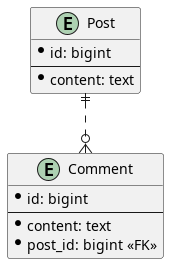
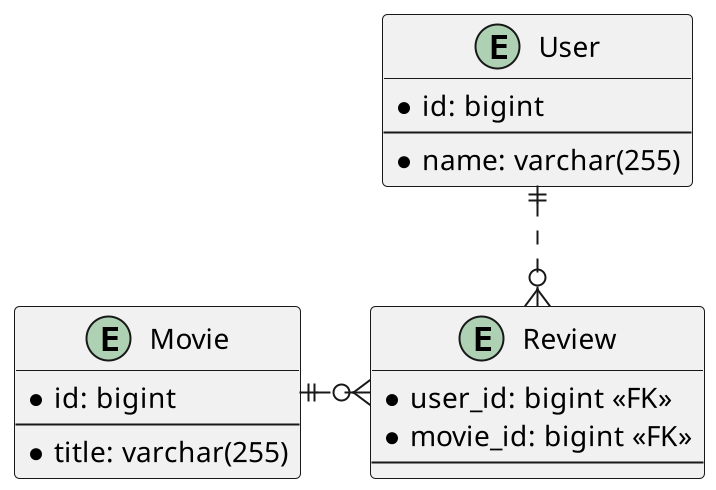

import { Divider } from "@chakra-ui/react";

In this article we are going to discuss some common JPA relationship mapping pitfalls.

This article is part of JPA Pitfalls series.
JPA makes it really easy to do things the wrong way, and makes it really
unintuitive to do things right.
In this blog post series I will go over some common JPA pitfalls and
show how to avoid them.

Articles that are part of this series:

- [Relationship mapping](/blog/02-jpa-pitfalls-relationship-mapping/) (this article)
- [Eager/Lazy fetching](/blog/03-jpa-pitfalls-eager-lazy-fetching/)
- Generating IDs (TBD)
- JPA and Lombok (TBD)

## 1. One-to-many Relationship Mapping

Assuming we have the following database schema:



We could create the following JPA entities:

- `Post`:

  ```java
  @Entity
  class Post {
      @Id
      @GeneratedValue
      private Long id;

      private String content;

      … // no-args constructor, getters and setters omitted for brevity
  }

  ```

- `Comment`:

  ```java
  @Entity
  class Comment {
      @Id
      @GeneratedValue
      private Long id;

      private String content;

      @ManyToOne
      private Post post;

      … // no-args constructor, getters and setters omitted for brevity
  }
  ```

`Comment` entity has a reference to a `Post` via a `@ManyToOne` binding.

Now, it might be tempting to also create a bidirectional binding,
so that we could have a list of comments when we fetch a post:

```java
@Entity
class Post {
    …

    @OneToMany(
        mappedBy = "post",
        cascade = CascadeType.ALL,
        orphanRemoval = true
    )
    private Set<Comment> comments = Set.of();
}
```

If we fetch a post, we will also get all of the comments as well --
that sounds very convenient.
But the problem is that we are going to get _all_ of the comments,
and there is no way to make it pageable.
Imagine if we had thousands or millions of comments on a post.
We would have to fetch them all from our database!

Instead, we could just have a unidirectional `@ManyToOne` association on the
`Comment` entity, and then we could run a custom query to get all post comments:

```java
@Repository
public interface CommentRepository extends JpaRepository<Comment, Long> {
    Set<Comment> findByPost_id(Long postId);
}
```

We could then make this query pageable simply by passing a `Pageable` instance
into our repository method:

```java
Page<Comment> findByPost_id(Long postId, Pageable pageable);
```

## 2. Many-to-many Relationship Mapping

Assuming we have the following database schema:



We could map it to the following JPA entities:

- `User`:

  ```java
  @Entity
  class User {
      @Id
      @GeneratedValue
      private Long id;

      private String name;

      … // no-args constructor, getters and setters omitted for brevity
  }
  ```

- `Movie`:

  ```java
  @Entity
  class Movie {
      @Id
      @GeneratedValue
      private Long id;

      private String title;

      … // no-args constructor, getters and setters omitted for brevity
  }
  ```

We could then use `@ManyToMany` annotation to connect these two together:

- `User`:

  ```java
  @Entity
  class User {
      …

      @ManyToMany(cascade = {
          CascadeType.PERSIST,
          CascadeType.MERGE
      })
      @JoinTable(
          name = "review",
          joinColumns = @JoinColumn(name = "user_id"),
          inverseJoinColumns = @JoinColumn(name = "movie_id")
      )
      private Set<Movie> movieReviews;
  }
  ```

- `Movie`:

  ```java
  @Entity
  class Movie {
      …

      @ManyToMany(mappedBy = "movieReviews")
      private Set<User> userReviews;
  }
  ```

Unfortunately, we now have the exact same problem that we had with `@OneToMany`
annotation.
If we fetch a user, we are going to get all of their movie reviews, and vice versa.
There is no way to make these queries pageable.

What we could do instead, is to create a new entity class that represents the
join table:

```java
class Review {
    @EmbeddedId
    private Id id;

    @ManyToOne
    @MapsId("userId")
    private User user;

    @ManyToOne
    @MapsId("movieId")
    private Movie movie;

    … // no-args constructor, getters and setters omitted for brevity

    @Embeddable
    static class Id implements Serializable {
        private Long userId;

        private Long movieId;

        … // no-args constructor, getters, setters, equals, and hashCode omitted for brevity
    }
}
```

We could then run custom queries to fetch what we need:

```java
@Repository
public interface ReviewRepository extends JpaRepository<Review, Long> {
    Set<Review> findByUser_id(Long userId);
    Set<Review> findByMovie_id(Long movieId);
}
```

And of course, we could pass in a `Pageable` instance to get a pageable response:

```java
Page<Review> findByUser_id(Long userId, Pageable pageable);
Page<Review> findByMovie_id(Long movieId, Pageable pageable);
```

## 3. Conclusion

Since it is not possible to create pageable queries using `@OneToMany` and `@ManyToMany`
annotations, they should usually be avoided.
The only exception to this rule is if you know that there will only ever exist very _few_
associated entities.
For example, if we have a `User` entity and users can have one or more roles assigned
to them, then it may be okay to use `@OneToMany` annotation, since we know
that there aren't going to be that many user roles.

It would've been better if `@OneToMany` and `@ManyToMany` were named
`@OneToFew` and `@FewToFew` instead,
to better indicate that they should only be used when there are only _few_ associated entities.
Alternatively, these annotations could just be deprecated or completely removed.
The added convenience of these annotations is really minor compared to all the
troubles they cause, so we would be better without them.
Unfortunately none of this will happen as it is too late now.
We can only try and educate people to stop using these
annotations everywhere without thinking about performance implications.

<Divider my={8} />

<a rel="license" href="http://creativecommons.org/licenses/by-sa/4.0/">
  
</a>
This work is licensed under a<a
  rel="license"
  href="http://creativecommons.org/licenses/by-sa/4.0/"
>
  Creative Commons Attribution-ShareAlike 4.0 International License
</a>.

<Divider my={8} />
