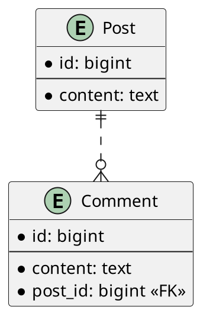

import { Divider } from "@chakra-ui/react";

In this article we are going to discuss different JPA fetching types,
their pros and cons, and see which one should you prefer.

This article is part of JPA Pitfalls series.
JPA makes it really easy to do things the wrong way, and makes it really
unintuitive to do things right.
In this blog post series I will go over some common JPA pitfalls and
show how to avoid them.

Articles that are part of this series:

- [Relationship mapping](/blog/02-jpa-pitfalls-relationship-mapping/)
- [Eager/Lazy fetching](/blog/03-jpa-pitfalls-eager-lazy-fetching/) (this article)
- [Generating IDs](/blog/04-jpa-pitfalls-generating-ids/)
- JPA and Lombok (TBD)

## 1. Introduction

Assuming we have the following database schema:



And assuming that we have the following corresponding JPA entities:

- `Post`:

  ```java
  @Entity
  class Post {
      @Id
      @GeneratedValue
      private Long id;

      private String content;

      … // no-args constructor, getters and setters omitted for brevity
  }
  ```

- `Comment`:

  ```java
  @Entity
  class Comment {
      @Id
      @GeneratedValue
      private Long id;

      private String content;

      @ManyToOne
      private Post post;

      … // no-args constructor, getters and setters omitted for brevity
  }
  ```

A JPA association can be fetched eagerly or lazily.
By default, `@ManyToMany` and `@OneToMany` associations use the `FetchType.LAZY` strategy,
while the `@ManyToOne` and `@OneToOne` associations use the `FetchType.EAGER` strategy.
It is also possible to change the default by specifying the desired `FetchType` in the
`fetch` attribute of the aforementioned annotations.

## 2. Eager Fetching

Since [you should mostly be using `@ManyToOne` associations](/blog/02-jpa-pitfalls-relationship-mapping/),
and it defaults to eager fetching, it is essential to understand what
that fetching strategy entails.

If we call `CommentRepository::findById` method from Spring Data repository,
it is going to fetch a comment with the specified ID, but it is also going to do a join
and fetch the associated post as well.

You can probably imagine that there can be many use-cases where we are only
interested in the comment itself, but we don't care about the post metadata.
So with the eager fetching strategy, we would make the database do all that
unnecessary work by joining the tables, returning a larger payload,
and we would also waste our app's resources by holding all of that unnecessary
data in memory.
This is why I consider eager fetching a terrible default, and I think you should never use it.

## 3. Lazy Fetching

As mentioned, we can control the fetching strategy via the `fetch` attribute.
So let's go ahead and change that terrible default:

```java
@Entity
class Comment {
    …

    @ManyToOne(fetch = FetchType.LAZY)
    private Post post;
}
```

Now if we fetch a comment, it is only going to fetch the comment itself,
and the `post` field will be empty.
Only if we try to access that field, will the JPA provider go ahead and fetch it
from the database in a separate query.
This is possible because JPA provider creates a proxy class around our entity
class at runtime, and augments our getter method.

## 4. Mixing Lazy and Eager Fetching Together

Lazy fetching behavior is way better than the default eager fetching, but it
is not without its problems.
What if we _do_ need to fetch that post metadata as well?
We are going to have to execute two separate queries which is always worse performance-wise
than a single query.
It would be great if we could choose the fetching strategy per query at runtime.
Fortunately, that is indeed possible!

To make an eager fetch, even though our entity declares lazy loading,
all we have to do is add `@EntityGraph` annotation to our query method:

```java
@Repository
public interface CommentRepository extends JpaRepository<Comment, Long> {
  @EntityGraph(attributePaths = {"post"})
  Set<Comment> findEagerById(Long id);
}
```

`@EntityGraph` annotation takes `attributePaths` where we have to
specify the field names that we want to fetch eagerly.

We now have the best of both worlds, and can choose the best strategy per individual query.

It is important to note that we can only "switch" to eager fetching at runtime
if we initially specified that we want lazy fetching in entity declaration.
If our entity declares eager fetching, then it is not possible to change it later.

## 5. Conclusion

1. Eager fetching is a terrible default.
2. All entities should always declare lazy fetching for all associations.
3. If we _do_ need to fetch associated entity as well, we can switch to eager fetching
   at runtime using `@EntityGraph`.

Follow the rules above and you are going to avoid many unnecessary queries and
unnecessary data fetching.

<Divider my={8} />

<a rel="license" href="http://creativecommons.org/licenses/by-sa/4.0/">
  
</a>
This work is licensed under a<a
  rel="license"
  href="http://creativecommons.org/licenses/by-sa/4.0/"
>
  Creative Commons Attribution-ShareAlike 4.0 International License
</a>.

<Divider my={8} />
