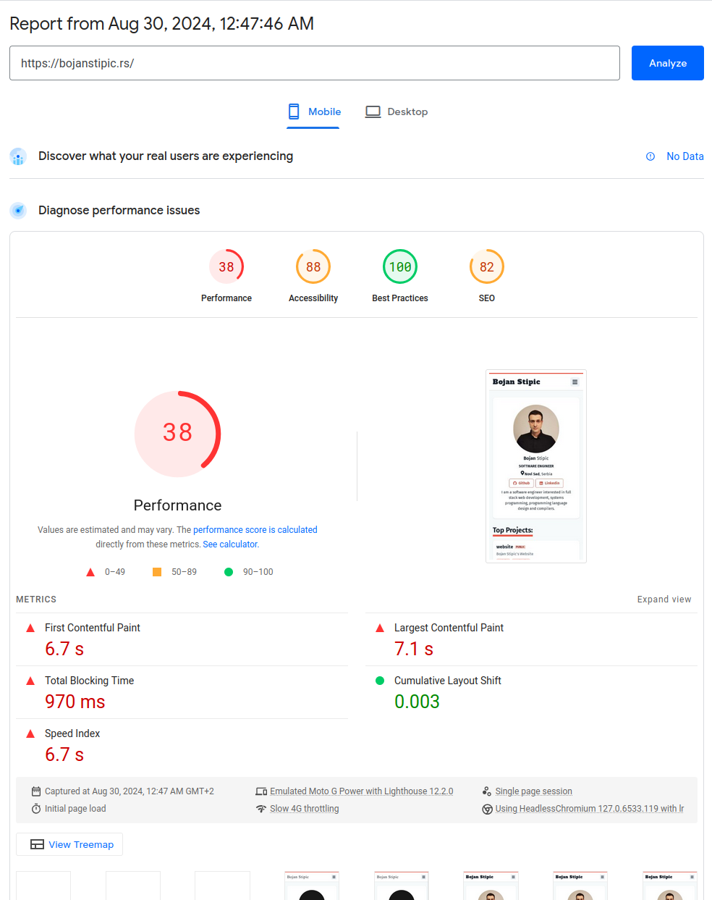
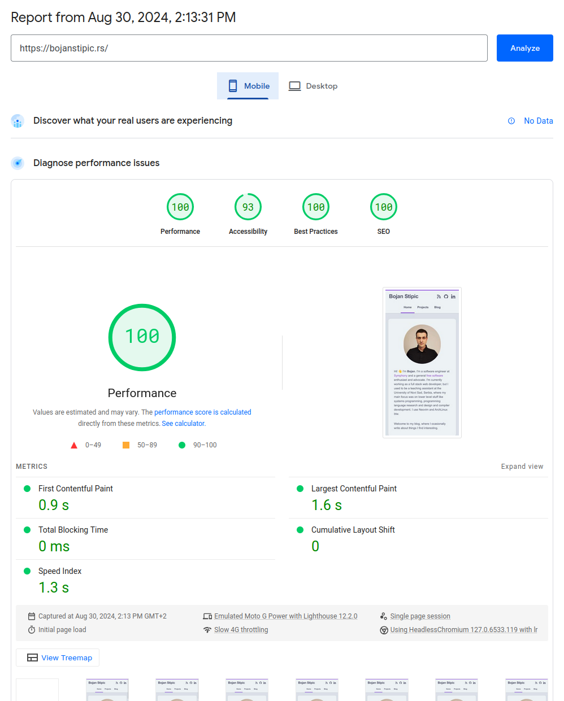
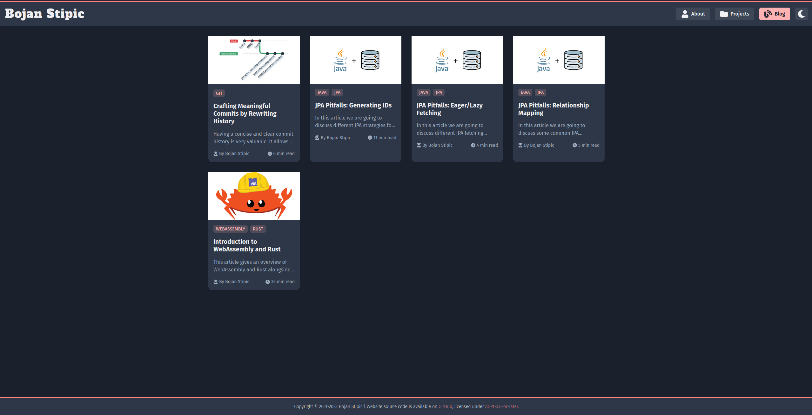

import CcByNdLicense from "@/components/licenses/CcByNdLicense.astro";

## 1. Migrating from Gatsby to Astro

I originally created this website in 2021 as a free platform for me to share my
knowledge and talk about things I find interesting.
At the time I was mostly using React on the frontend at my job, so I started
looking for React based static site generators as that was the technology I was
the most familiar with.
After some investigation I decided to use [Gatsby](https://www.gatsbyjs.com/)
as it was one of the most popular options at that time.
In addition to that, I went all-in with React and decided to use [Chakra
UI](https://chakra-ui.com/) for the UI components and as a general CSS-in-JS
styling solution.

The website worked okay but I always felt uncomfortable with all the
unneeded complexity.
Gatsby provides a GraphQL server at build time which you can use to query and
store static content.
On top of that, you need an [absurd number of
dependencies](https://github.com/BojanStipic/website/blob/v1-gatsby/package.json)
just to get Markdown/MDX content to render.
It always felt insane to me that I need this many abstractions on top of
abstractions just to get a simple blog working.

Another thing I found annoying was the poor runtime performance and the amount
of client-side JavaScript that gets bundled into the final build.
When you build a website with Gatsby, all React components get rendered at
compile time and the resulting static HTML and CSS files can be stored on a CDN
and served directly.
This sounded great at first, but then I realized that you do not actually get
rid of any runtime JavaScript in the process!
That giant JavaScript bundle with all of your React components still loads in
the user's browser which starts the process called "hydration" -- allowing
React to attach to the existing pre-rendered HTML which makes the website
interactive.
The only thing pre-rendering achieves is to make the initial page load seem
faster.
After the hydration process is done, you basically get the same old SPA with
client-side React that we always had.

Here's the Lighthouse score for my old website:

Since I was using Chakra UI and CSS-in-JS for styling, the performance problems
were even worse.
Gatsby does not know user's color scheme preference at build time so it
generates a website using light theme by default.
If a user has a dark theme preference, they will first see a white page as the
initial HTML and CSS loads, and only after the hydration process is finished
the colors will switch to the dark color scheme.

This triggered my OCD so hard I had to start looking for a solution, and so I
finally did, and it's called [Astro](https://astro.build/)!
I decided to start everything from scratch, so it was a lot of work, but the
results are well worth it.

In Astro you write components in `.astro` files which have a syntax very
similar to JSX.
Astro is also framework agnostic, so you can optionally use React, Vue, Angular
or any other [official
integrations](https://docs.astro.build/en/guides/framework-components/)
available.
This time I decided to keep it simple, so `.astro` files were more than enough
for me.

There is no more GraphQL, everything is so much simpler with Astro.
You get some nice helper functions for working with content collections, and
you just write some simple JavaScript or TypeScript.
When you generate a build, all of the code is executed at compile time and by
default you just get some static HTML and CSS files for each page.
There is **zero runtime JavaScript** by default!
You can choose to make some parts of your website interactive and Astro will
include the necessary JavaScript only for that part of the application, but
everything else will still be HTML only.

At the time of writing this blog, Chakra UI uses [Emotion](https://emotion.sh)
under the hood which is a runtime CSS-in-JS library, so it cannot generate CSS
at build time.
There is a plan to migrate it to [Panda CSS](https://panda-css.com/) which
would allow for build time generated styles, so this may not be an issue in the
future, but for now I decided to just use [Tailwind](https://tailwindcss.com/)
instead.
And I am very happy with that decision.
Tailwind is very simple and now that I've tried it, I don't think I would want
to go back.

Astro and Tailwind solved all of the problems I had with my old website.
There are no more visual glitches on initial page load, and the performance is
much better.
And since there is zero JS on the client, there is less CPU usage, which is
especially important on battery powered devices.
The bundle size is also smaller, so the download is faster, and less bandwidth
is consumed which can be an important factor for users on a metered connection.

Here's the Lighthouse score for my new website:

A perfect 100/100 score!

## 2. Redesign

Since I basically recreated my website from scratch with very little code
reuse, I thought it was a good opportunity to also create a new design to keep
things fresh.

Here's how the old website looked like:

I am now using [Catppuccin](https://catppuccin.com/) color scheme.
I've been using that color scheme on my laptop for almost everything -- Neovim,
Tmux, Fish, Firefox, GTK, etc. so I wanted to do the same for my website, and
I'm very pleased with the results.

## 3. Migrating from Netlify to Cloudflare Pages

One more thing I didn't like about my website is my hosting provider --
[Netlify](https://www.netlify.com/).
It is very easy to use and the free plan is generous, but the thing that made
me want to find an alternative is that you can not set a spend limit on your
account.
So for example, if someone decided to DDOS me, my bill could go up and I would
have a legal obligation to pay that to Netlify.
There are many stories online of people incurring $100k charges for a blog, and
then they have to go viral on Reddit/Twitter hoping to be forgiven and have the
charges dropped.
I think that business model is insane, so I moved to [Cloudflare
Pages](https://pages.cloudflare.com/).

Cloudflare also does not allow you to set a spend limit actually, but they
offer _unlimited_ requests and bandwidth in the free plan, so it is not
possible to get unintentional charges from a DDOS attack.

A nice little bonus is that Cloudflare's CDN network is larger and seems to be
faster compared to Netlify, so I also got some additional speed improvement
with the switch.

## 4. New TLD

I originally purchased `bojanstipic.rs` domain for this website, but I now
think that was a mistake.
Two-letter TLDs are reserved for countries, so geopolitical changes can cause
existing TLDs to cease to exist.
This has already happened in the past with the fall of Soviet Union and
Yugoslavia and will potentially happen again with the `.io` domain after the
recent British government announcement that it was giving up sovereignty of
Chagos Islands to Mauritius.
If you are interested in this topic and would like to read more, I recommend
reading this [article from Gareth
Edwards](https://every.to/p/the-disappearance-of-an-internet-domain).

In addition to the problem outlined above, the `.rs` domain was simply more
expensive for me to rent compared to the `.com` domain, so there was no reason
to keep using that and I decided to make a switch.

## 5. Conclusion

The new version of my website had lots of visible and under the hood changes:

- Completely redesigned with Catppuccin color scheme.
- Migrated from Gatsby to Astro and it now has 0 runtime JavaScript and a
  perfect 100/100 Lighthouse score.
- Using Cloudflare Pages instead of Netlify for hosting.
- Using `.com` TLD instead of `.rs`.

It was a fun experiment and in the end I got a website that looks nicer, has
zero runtime JavaScript, loads much faster, and is much easier to maintain.

<CcByNdLicense />
