This article gives an overview of WebAssembly and Rust alongside practical
step-by-step examples of how to use them in your next Web app.
If you would like to speed up performance-critical parts of your app,
port a legacy codebase to the Web,
or completely write your frontend in a programming language other than JavaScript,
then this blog post is for you!

## 1. WebAssembly Introduction

WebAssembly (abbreviated Wasm) defines a format for
universal architecture independent executables.

It is a completely open standard with an extensive specification.
Announced in 2015, and first released in 2017,
WebAssembly became a World Wide Web Consortium (W3C) recommendation in 2019.

Wasm is designed to be used as a compilation target.
Instead of writing Wasm code by hand,
we can write programs as usual, in any programming language we already know and love,
and then compile them into Wasm.
At the time of writing, there are ~45 languages
[reported to support Wasm](https://github.com/appcypher/awesome-wasm-langs)
as a compilation target.

Wasm is designed to be portable, compact, and execute at or near native speeds.
WebAssembly, as the name suggests, was first meant to be used on the Web,
but because of the above characteristics and its open specification,
today it can used pretty much anywhere.

Wasm is available on:

- **The Web**

  Wasm can be executed directly in Web browsers.
  This will be the main focus of this article, so we will talk about this in great detail
  in the following sections.

- **Node.js**

  Wasm can be executed in Node.js, meaning that Node.js is not just
  a JavaScript runtime anymore, but a runtime for any programming language that can
  be compiled to Wasm.

- **Embeddable in other programs**

  Since Wasm is a simple format that is easy to parse,
  Wasm can be embedded into other programs simply by importing a Wasm runtime
  in the form of a library.

  Because of this, Wasm can be used to implement a plugin system.

  Take extensible text editor Vim as an example -- in order to
  write a plugin in Vim, user is required to use Vimscript, which is a language
  only used in Vim.
  This makes writing plugins for Vim not very accessible.
  On the other hand, there are newer generation editors, such as Neovim that uses
  Lua for writing plugins, or Atom that is written in web technologies and allows writing
  plugins in JavaScript;
  Since these languages have much wider usage, writing plugins for these editors
  becomes more accessible.
  But, we can go a step further by allowing plugins to be written in Wasm --
  now users can use _any_ programming language that can be compiled to Wasm to write plugins.
  This makes the barrier to entry very low, and allows for a thriving plugin ecosystem.

- **Kernel**

  This is currently experimental, but there is an ongoing effort to create a kernel
  that can execute Wasm binaries directly.
  This would allow all user space programs to be compiled into Wasm once,
  and then executed on any computer,
  independent of the target CPU architecture,
  as long as the kernel itself supports that architecture.

## 2. WebAssembly on the Web

All major browsers today can run Wasm natively.

The following are the use cases to use Wasm on the Web:

- **Speed up performance-critical parts of an app**

  Since Wasm is a simple format that is easy to parse,
  programs written in Wasm usually give better performance compared to JavaScript.

- **Existing programs can be ported to run on the Web**

  For example, a legacy desktop app written in C or C++ can be ported
  to run on the Web with very little effort, by using a compiler that can compile
  these languages to Wasm.

- **Write frontend apps in any programming language that can compile to Wasm**

  To do any kind of frontend programming, previously there was no choice --
  JavaScript had to be used as that was the only programming language
  understood by browsers.
  With the introduction of Wasm on the Web, it is now possible to use any programming
  language to write frontend apps.
  If someone does not know JavaScript, or does not want to use it for any reason,
  they can now choose to use a different programming language they like.

Alright, so now that we know what is WebAssembly and why it is important,
let's now switch over to the other main topic of this article -- Rust.
After introducing Rust, we will see how these 2 technologies piece together.

## 3. Why Rust?

Rust is a systems programming language with a focus on **performance**,
**reliability** and **productivity**.

The distinction between systems programming and application programming is that
the latter aims to produce software which provides services to the user directly,
whereas systems programming aims to produce software which provide services to other software.
Examples of system programs are operating systems, compilers, Web browsers, etc.
Rust was initially developed by Mozilla with the goal of using
it to write parts of Firefox browser.

- **Performance**

  Programs written in Rust are fast and memory efficient, with no runtime.
  There is no garbage collector, green threads, or anything else that would
  have a runtime overhead.
  On one hand, programming in Rust is more complex compared to other
  higher level languages, but on the other hand it allows us to have complete
  hardware control and great performance.
  Everything in programming language design is a trade-off, and since Rust
  is a systems programming language, it values performance over complexity.

- **Reliability**

  Rust has a rich type system and ownership model that guarantee
  memory-safety and thread-safety.
  These types of bugs are a compile time error in Rust, which means that
  programs that do compile are guaranteed not to have these issues.
  This gives confidence that programs written in Rust are highly reliable.

- **Productivity**

  Productivity here means developer productivity.
  Developer experience is excellent with Rust.
  Documentation is great; there is an official Rust book for learning the language,
  and the standard library is completely documented with runnable examples for most
  functions.
  Package manager and build tool is builtin, and the compiler gives very friendly
  error messages.
  There is also an LSP server, formatter, documentation generator, test runner,
  and everything else one might expect from a modern language.

### 3.1. So What Does Rust Have to Do with WebAssembly?

Rust is great because we don't have to choose between performance, reliability,
and productivity -- we can have all three!

Performance and memory efficiency is especially important for Wasm,
because Wasm does not provide any runtime out of the box.
Any programming language runtime machinery that runs under the hood would also
have to be compiled to Wasm and distributed to users.
Large codebases not only take a while to download, but they can also cost
users' money, because not everyone has an unlimited data plan.
On mobile devices it is especially common to have limited data available,
so users would not be happy to have their data wasted.

### 3.2. But Why Not C++?

C++ also gives **performance** comparable to Rust.
Both languages compile to LLVM, which benefit from the same optimizations,
making the final code run fast with no overhead.

Unfortunately, **reliability** is lacking.
C++ has no memory-safety and thread-safety guarantees, and these bugs can be
especially hard to debug.

According to Microsoft, ~70% of the security vulnerabilities Microsoft assigns a CVE
each year continue to be memory safety issues.


Programmers have to be very careful in order to avoid these issues, and there
is a huge set of rules which should be checked manually, because the compiler
is not able to help.
For example, C++ Core Guidelines written by Bjarne Stroustrup (the creator of C++)
are ~700 pages long, and most of the rules cannot be checked by the compiler.

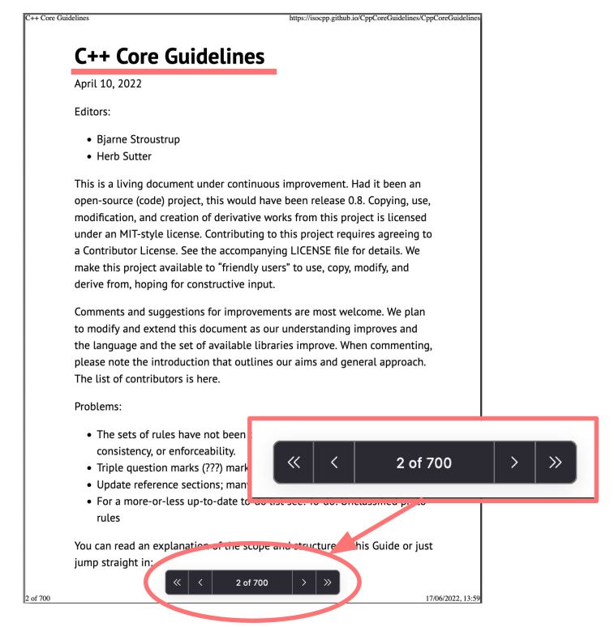

Newer C++ versions introduce new concepts that make it easier to avoid mistakes,
but the problem is that they cannot remove old non-idiomatic features,
because of backwards compatibility.
On the other hand, Rust is a newer language that learned from past mistakes, and
borrowed only the good parts of C++.
Additionally, Rust has a concept of "editions" which makes it possible to introduce
backwards incompatible changes when needed.

Aside from that, developer **productivity** is also lacking in C++.
Tooling is not great -- there is no standard package manager, or code formatter,
and compiler messages can be unreadable when templates are involved.

### 3.3. But Why Not Python?

Python, on the other hand provides good developer **productivity**.
It is very easy to write a quick Python script and get it working in no time.

Unfortunately, **performance** is not great.


This is especially important for WebAssembly, because the whole Python runtime
machinery has to also be compiled to Wasm.
To put things into perspective, a simple "hello world" program written in Python
produces ~10MB Wasm module, but a simple "hello world" program written in Rust
takes only ~2-3KB.

Regarding **reliability**, Python obviously does not have memory-safety issues,
because it has a garbage collector, so we don't have to worry about manual memory management,
but there can still be thread-safety issues and because it does not have a statically
checked type system, programs written in Python do not give much confidence
in terms of reliability.

## 4. A Quick Introduction to Rust

Now that I explained the reasons why I think Rust is a great language and a good fit
for WebAssembly, in this section I will give a quick introduction to Rust.

For the purposes of this article, we will focus only on 1 feature that is
unique to Rust -- ownership and borrowing.

But first, let's see the obligatory "hello world" example:

```rust
fn main() {
    println!("Hello, World!");
}
```

Rust has a C-like syntax. Functions are defined using the `fn` keyword.
Function named `main` is special -- it is the first code that runs in every
executable Rust program.

In the example above, all that `main` function does is call the `println` macro.
We can tell that `println` is a macro and not a normal function because it
was entered as `println!` (with the `!`).
Macros are out of scope of this article, but for know you just need to know that
using a `!` means that you are calling a macro instead of a normal function,
and that macros don't always follow the same rules as functions.

### 4.1. Ownership Rules

Now to the interesting part.
Ownership and borrowing is Rust's most unique feature and has deep implications
for the rest of the language.
It enables Rust to make memory safety guarantees without needing a garbage collector.

Ownership rules:

1. Each value in Rust has a variable that's called its owner.
2. There can only be one owner at a time.
3. When the owner goes out of scope, the value will be dropped.

The following is an example that demonstrates ownership rules:

```rust
fn main() {
    let s = String::from("world");
    println!("Hello, {}", s);
}
```

First, the string value `"world"` is created and assigned to the variable `s`.
The variable `s` is called the owner of that string value.

Now that `s` is the owner of the string `"world"`, there cannot be any other
variable that is also the owner of that same string value.

When `s` goes out of scope (at the end of the `main` function),
it releases all resources that were allocated for the owned value.
This way, there is no need for garbage collector.

If it was possible to create multiple owners to a single value,
it would not be clear which owner would be responsible to release resources.
If they would both try to release same resources, that would be one of the
memory safety bugs -- double free bug.

The most important thing is that all of the rules above are **enforced by the compiler**,
and if any of these rules are violated, the program will not compile.

In other languages without garbage collector, for example C++, in order to
create a program without memory-safety bugs, we would still have to follow
all of the rules above.
The difference is that these rules are not enforced by C++ compiler,
so we could easily make a mistake and create a bug that is very hard to debug.

### 4.2. Move Semantics

Now that we have seen ownership rules, and now that we know that a value
can only have a single owner, the question is what would happen if we
tried to assign a value from 1 variable to another:

```rust
fn main() {
    let s1 = String::from("hello");
    let s2 = s1;
    println!("Hello, {}", s1);
}
```

A JavaScript programmer would probably say that after `s1` is assigned to `s2`,
they are just references that now both point to the same string.
This would be okay in a language with garbage collector, but it would be very
wrong to have 2 owners in Rust, as explained in the previous section.

On the other hand, a C++ programmer would probably say that `s2 = s1` does a
deep copy, so now `s1` and `s2` would be owners of 2 completely unrelated strings.
This would solve the 2 owners problem, but the problem is that deep copy
can be a very expensive operation, depending on how large the value is.

Rust decided to do a different thing -- assignment has move semantics by default.
When we write `s2 = s1` we state that `s1` is _moved_ to `s2`.
In other words, `s1` gives ownership of string `"hello"` to `s2`.
After giving ownership, `s1` is no longer valid and compiler forbids using `s1`
afterwards.

In the example above, trying to access `s1` in `println` would give a compile time error:

```rust
error[E0382]: borrow of moved value: `s1`
```

To better understand what _moving_ means, let's see what happens under the hood:

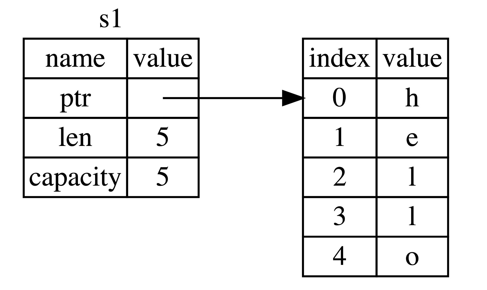

`s1` is stored on stack and contains a pointer to the heap allocated string,
a length, and a capacity.

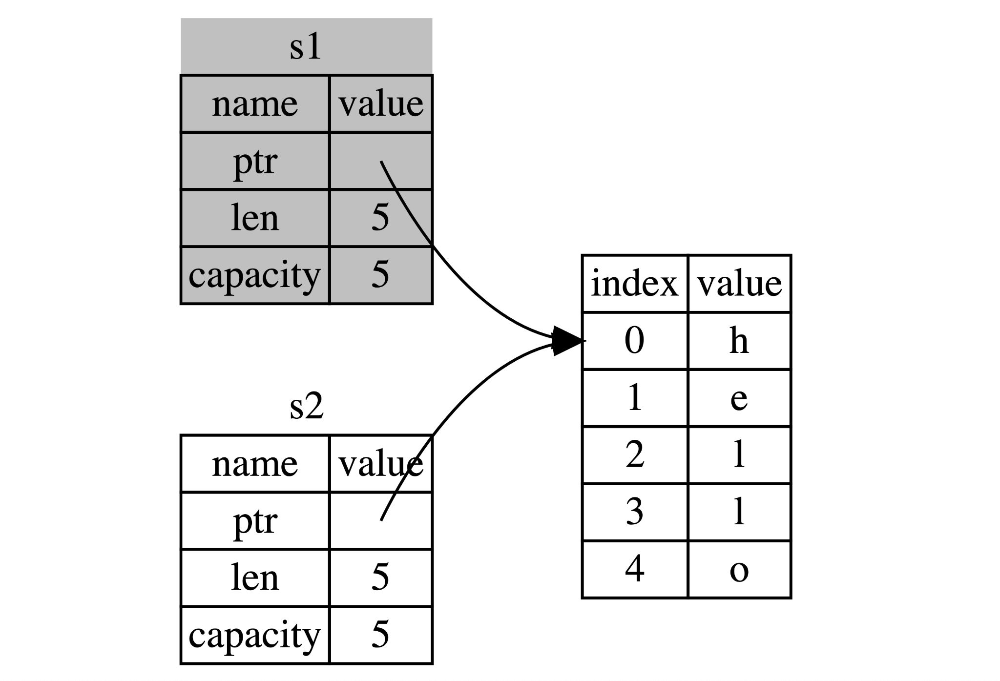

Moving `s1` to `s2` will just copy the value on the stack.
Now `s1` and `s2` both point to the same heap allocated string.
That would normally be a problem, because there shouldn't exist 2 owners
of the same value, but Rust compiler is aware of move semantics, and will mark
`s1` as invalid and will not allow us to use it afterwards.
This way, we avoided a potentially expensive deep copy, but still managed
to preserve the only one owner rule.

**Note for C++ developers**:

Move semantics exist in C++ and originated in C++11.
Rust actually borrowed this concept from C++.

Problem is that C++ does deep copy by default.
If we wanted to do a move instead, we would have to write `s2 = std::move(s1)`.
This is the opposite of what Rust does.
Rust makes potentially expensive operations always explicit,
so if we wanted to do a deep copy we would have to request that explicitly by
writing `s2 = s1.clone()`.
Being explicit is better because that means that the programmer didn't opt-in
to do an expensive operation by accident, but that they are aware of it and
decided to do it after careful consideration on a case by case basis.

Another problem is that C++ compiler does not prevent us from using `s1` after move.
We could try to use `s1` after moving, and the program would compile,
but accessing `s1` would be undefined behavior that would be very hard to debug.

### 4.3. Function arguments are also moved

An interesting thing to point out is that values passed as function arguments
are also moved:

```rust
fn main() {
    let s1 = String::from("hello");

    let len = calculate_length(s1);

    println!("The length of '{}' is {}.", s1, len);
}

fn calculate_length(s: String) -> usize {
    s.len()
}
```

Here we have `calculate_length` function, which takes a string as parameter.
As the name implies, the purpose of this function is to calculate the length
of given string.

In `main` function, we create `s1` and pass it to `calculate_length` function.
Ownership of `s1` is now moved to `s`.
Since `s` is local to `calculate_length` function, it will go out of scope at the end
of the function, and it will deallocate the value `"hello"`.

If we then try to print `s1`, we will rightfully get a compile time error:

```rust
error[E0382]: borrow of moved value: `s1`
```

If we were to write an equivalent C++ program, this would compile,
but would be an undefined behavior which would be very hard to debug.
Fortunately, Rust compiler saved us once again, and prevented us from making the mistake.

Now, this is all great, but it would be very tiresome to program in Rust if all
functions would just "eat" all of their arguments.
If a function should just calculate the length of a given string, there is no need
for it to take ownership and deallocate that string.
Luckily, there is a solution to this problem -- Rust has a feature for using
a value without transferring ownership, called references.

### 4.4. References and Borrowing

Instead of giving ownership of a value, it is possible to just borrow a value for
some time, and then return it back later.
Borrowing values produces references.

```rust
let s = String::from("hello");
let r1 = &s;
```

To borrow a value, instead of transferring ownership, we just have to add `&`
in front of a variable.
`r1` is now a reference to the string `"hello"`.
The ownership rules are not violated, because we still have only 1 owner,
we are just borrowing the value temporarily.

In the example above, `r1` is an immutable reference.
This means that we can read the value by accessing `r1`,
but we are not allowed to change the string in any way or deallocate it.

Similar to immutable references, it is also possible to create a mutable reference:

```rust
let mut s = String::from("hello");
let r1 = &mut s;
```

Instead of `&`, we have to use `&mut` to create a mutable reference.
In this case, `r1` can read the string and modify it,
but it is still not able to deallocate it.
Only the owner is able to drop the string.

Like ownership rules, references also have some rules that Rust compiler enforces.

References and borrowing rules:

1. At any given time, you can have either one mutable reference
   or any number of immutable references.
2. References must always be valid.

First rule is interesting because that means that Rust allows mutation only in
a very controlled manner.
The benefit of having this restriction is that Rust can prevent data races
at compile time.
For data race to happen, 2 or more threads must have access to a shared resource,
where at least 1 thread has write access.
Data races cause undefined behavior and can be difficult to diagnose and fix.
Rust prevents this problem by refusing to compile code with data races.

The second rule states that references must always be valid.
To explain what "being valid" means, it is best to look at some examples:

```rust
fn main() {
    let r1;
    {
        let s = String::from("hello");
        r1 = &s;
    }
    println!("{}", r1);
}
```

1. Variable `r1` is created, but not initialized immediately.
2. A new block is opened, in order to create a new scope.
3. In the inner scope, a new string is created and assigned to the owner `s`.
4. `s` is borrowed and the reference is assigned to `r1`.
5. The inner block goes out of scope, so all of the owners that
   were declared inside of that scope deallocate their values.
6. We try to read the string by accessing `r1`.

`r1` is a reference to a string that has been deallocated, and trying to access it
would be a bug.

If we were to try to do the same thing in C++, this code would compile,
but would be an undefined behavior, which would be very hard to find and fix.

Thankfully, Rust compiler jumps in to the rescue once again.
The compiler is able to understand that references cannot outlive the owner,
and prevents us from compiling the program.

```rust
error[E0597]: `s` does not live long enough
--> src/main.rs:5:14
  |
5 |         r1 = &s;
  |              ^^ borrowed value does not live long enough
6 |     }
  |     - `s` dropped here while still borrowed
7 |     println!("{}", r1);
  |                    -- borrow later used here
```

What is especially nice is that compiler gives a very user friendly message,
and explains exactly what the problem is and how to solve it.

Let's look at another example:

```rust
fn borrow_local() -> &String {
    let s = String::from("hello");
    return &s;
}
```

1. A local variable `s` is created, and is the owner of string `"hello"`.
2. We try to borrow `s` and return the reference from the function.

Again, an equivalent program in C++ would compile, but this is also an
undefined behavior.
Since `s` is local to this function, it would get out of scope at the end of the
function, and would drop the string `"hello"`.
So, the returned reference would point to string that does not exist.
Trying to access that string via this reference would cause an undefined behavior.

Rust knows that a reference cannot outlive the owner, and refuses to compile
this program.

```rust
error[E0106]: missing lifetime specifier
--> src/main.rs:5:22
  |
5 | fn borrow_local() -> &String {
  |                      ^ expected named lifetime parameter
  |
  = help: this function's return type contains a borrowed value, but there is no value for it to be borrowed from
```

### 4.5. Function arguments passed by reference

Now that we have learned about references and borrowing, we can return back to
one of the previous examples where we saw `calculate_length` function.
The function was calculating the length of a string that was passed in as a parameter,
but it was also taking ownership of that string, so it would "eat" the value.

To solve the problem, we just have to change `calculate_length`
to take a reference to string instead:

```rust
fn main() {
    let s1 = String::from("hello");

    let len = calculate_length(&s1);

    println!("The length of '{}' is {}.", s1, len);
}

fn calculate_length(s: &String) -> usize {
    s.len()
}
```

When the `calculate_length` is called, we no longer give ownership of `s1`,
but borrow it instead.
After the function returns, we can continue using `s1` normally.

## 5. Compiling Rust to WebAssembly

Alright, if you are still reading this, you have come to the fun part.
We are going to compile a Rust program to WebAssembly and run it in our browser.

Prerequisites:

1. Install the [Rust toolchain](https://www.rust-lang.org/tools/install)
2. Install [wasm-pack](https://github.com/rustwasm/wasm-pack)

   We are going to need wasm-pack in order to compile programs to Wasm.
   We can install it using `cargo` -- the Rust's package manager:

   ```bash
   $ cargo install wasm-pack
   ```

3. Create a new package:

   We can also use `cargo` to initialize a new package:

   ```bash
   $ cargo new --lib hello-wasm
   ```

   This creates a new library in directory named `hello-wasm` and initializes
   the following file structure:

   ```text
   +-- Cargo.toml
   +-- src
       +-- lib.rs
   ```

   `Cargo.toml` is analogous to `package.json` -- here we can specify some
   metadata about our package, and also declare dependencies.

   In `src` directory, `lib.rs` file was created, which is the root source file.
   We are going to put all of our source code there.

4. Write a simple program:

   ```rust
   use wasm_bindgen::prelude::*;

   #[wasm_bindgen]
   pub fn factorial(n: u32) -> u32 {
       (1..=n).product()
   }
   ```

   `factorial` is just a normal Rust function.
   The function is prefixed with `pub` which means that it has public
   visibility and is available outside of the library.
   The only unusual thing we have to do to make it compile to Wasm is to
   add the `wasm_bindgen` attribute.
   We will talk more about wasm-bindgen in later chapters, but for now
   we just have to know that it will generate some JavaScript glue code
   for us that is required in order to be able to use `factorial` from the browser.

   I intentionally chose to show `factorial` function, so that we can see
   how Rut provides some nice abstractions that makes it possible to write
   concise and easy to read code.
   `(1..=n)` construct creates an inclusive range of unsigned integers from `1` to `n`.
   Ranges are iterable so we can use on them any method available in
   [`Iterator`](https://doc.rust-lang.org/std/iter/trait.Iterator.html) trait.
   One such method is `product` which iterates over the entire iterator,
   multiplying all of the elements.
   You can think of it like a specialized `reduce` function.

   What is especially nice and important to note is that all Rust's abstractions
   are "zero cost" abstractions.
   This means that these abstractions do not have any runtime cost.
   Using these abstractions produces code that has exact same runtime performance
   as an equivalent hand written code.

5. Configure the `Cargo.toml` file:

   Inside of `Cargo.toml` file we just need to add `wasm-bindgen` as a dependency:

   ```toml
   [package]
   name = "hello-wasm"
   version = "0.1.0"
   license = "GPL-3.0-or-later"
   edition = "2021"

   [lib]
   crate-type = ["cdylib"]

   [dependencies]
   wasm-bindgen = "0.2.80"
   ```

6. Build the project:

   Now that we have our simple Rust program, we can compile it to Wasm:

   ```bash
   $ wasm-pack build --target web
   ```

   This does a number of things in the background:

   - Compiles Rust code to WebAssembly.
   - Runs wasm-bindgen on that WebAssembly, generating a JavaScript file that
     wraps up that WebAssembly file into a module the browser can understand.
     We are going to see this JavaScript glue code in more details in the following sections.
   - Creates a `pkg` directory and moves that JavaScript file and our
     WebAssembly code into it.
   - Reads `Cargo.toml` and produces an equivalent `package.json`.
   - Copies `README.md` into the package.
   - Generates Typescript type definitions in `.d.ts` file.

   What we get in `pkg` directory as a result is ready to be published to npm.
   After our library is published to npm, anyone can import it and use it
   like any other regular JavaScript library.
   They can get all of the performance benefits of using Wasm, but without
   even having to be aware that we were using Wasm in the first place.

   For the purposes of this article, we are not going to publish this package to
   npm, but instead we are going to import it and use it directly from an `index.html` page.

7. Use the built package:

   ```javascript
   <!DOCTYPE html>
   <html>
       <body>
           <script type="module">
               import init, {factorial} from "./pkg/hello_wasm.js";
               init().then(() => {
                   console.log(factorial(10));
               });
           </script>
       </body>
   </html>
   ```

   We can import `factorial` and use it like a normal JS function.
   The only thing different is that we first have to import `init` function
   and call it once in order to initialize Wasm module.
   In the future, it will be possible for `script` element to import
   Wasm module directly, but for now we have to have some JavaScript code
   in order to initialize it.

## 6. Function Arguments and Return Values

In this section we are going to talk about that JS glue code in more details.

For a given Rust program:

```rust
use wasm_bindgen::prelude::*;

#[wasm_bindgen]
pub fn factorial(n: u32) -> u32 {
    (1..=n).product()
}
```

wasm-bindgen generates the following JS glue code:

```javascript
export function factorial(n) {
  const ret = wasm.factorial(n);
  return ret;
}
```

The generated code does not do a whole lot.
It just creates a wrapper JS function named `factorial`, which internally
calls `factorial` from Wasm module, and then returns the result.

Wasm currently only supports functions that deal with number types,
and since `factorial` only dealt with numbers, the generated JS glue code was
trivial.

If our function accepted some other type as an argument, for example a string,
the generated code would be more complicated.

Passing a JS string to a Wasm function:

```rust
use wasm_bindgen::prelude::*;

#[wasm_bindgen]
pub fn length(s: &str) -> usize {
    s.len()
}
```

Since Wasm doesn't have support for strings out of the box,
wasm-bindgen has to do some magic for us behind the scenes.
To understand what it does, we first have understand how memory works in Wasm modules.

Browser API provides `WebAssembly.Memory` which is passed to Wasm module
upon initialization.
`WebAssembly.Memory` is a wrapper around fixed-length raw binary data buffer `ArrayBuffer`.
That array buffer represent the entire heap of a compiled Rust application.
It can be accessed from Rust, but it can also be accessed from JS,
so it can be used as a shared resource.

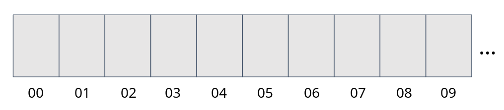

So, when we want to pass a string from JS to Wasm, we can write that string somewhere
in that `WebAssembly.Memory`, and then instead of passing a string to Wasm function directly,
we can pass a pointer and a length of that string.
Since pointer and a length are just numbers, this way we managed to indirectly pass a string
to a Wasm function.

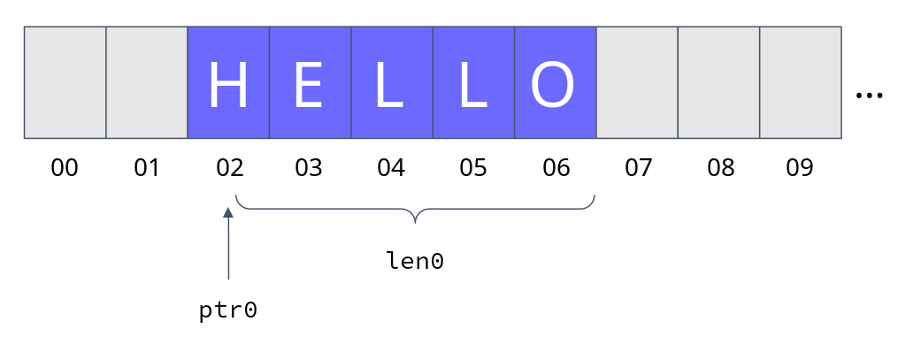

Generated JS glue code for the `length` function above:

```javascript
export function length(s) {
  const [ptr0, len0] = passStringToWasm0(
    s,
    wasm.__wbindgen_malloc,
    wasm.__wbindgen_realloc,
  );

  const ret = wasm.length(ptr0, len0);
  return ret;
}
```

In the snippet above we can see that the generated code first calls `passStringToWasm0`
helper function, which does exactly that -- it copies the JS string to the Wasm heap,
and then returns a pointer `ptr0` and a length `len0`.
These 2 values are then passed to the Wasm `length` function.

Not only can we pass the strings to functions, we can pass _any_ object/struct
and wasm-bindgen will do the magic for us in a similar way.

## 7. Interacting with JavaScript and the DOM

In this section we are going to see how to interact with browser APIs from Wasm.

Using JS `alert` function:

```rust
use wasm_bindgen::prelude::*;

#[wasm_bindgen]
extern {
    pub fn alert(s: &str);
}

#[wasm_bindgen]
pub fn greet(name: &str) {
    alert(&format!("Hello, {}!", name));
}
```

In order to use a JS function in Rust, we have to declare it inside of an `extern` block.
This is required because Rust is a statically typed language, and it would refuse
to compile the code if we tried to use `alert` function without specifying what
it is and where it came from.
By specifying function declaration inside of an `extern` block, we are telling
the compiler that a function named `alert` exists somewhere outside of this library,
and that it takes a single argument of type string.

wasm-bindgen will make sure to provide this function to the Wasm module
upon initialization, and that's it! That is all we had to do!

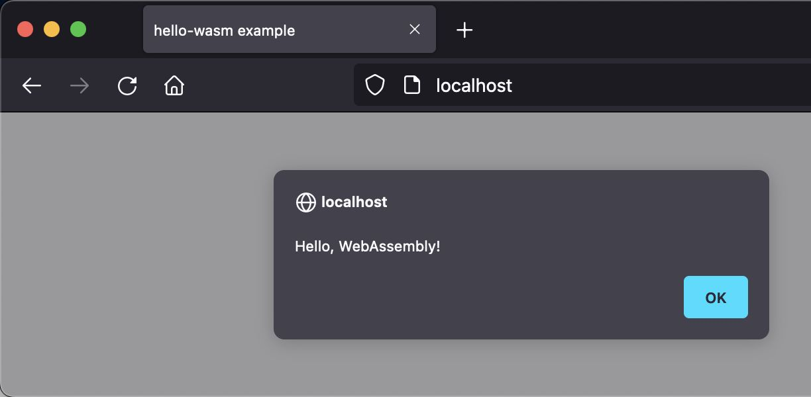

Similarly, we could import any other function from the Web API.
The only thing we have to do is provide a correct declaration inside of an `extern` block.

The only downside is that we have to type all of those declarations manually,
which is a lot of boilerplate code, and it is also possible to write a wrong
declaration and the Rust compiler won't be able to tell us that there is an error
because it is not aware of the Web API.

Now, we can do better than this, and use
[js-sys](https://crates.io/crates/js-sys) and
[web-sys](https://crates.io/crates/web-sys) crates instead.
These creates are actually nothing special, but just provide these `extern` blocks
already typed for us.
We can just import whatever we need and start using it.

Example of DOM interaction using `web-sys` crate:

```rust
use wasm_bindgen::prelude::*;
use web_sys::window;

#[wasm_bindgen]
pub fn dom_interaction() {
    let window = window().unwrap();
    let document = window.document().unwrap();
    let target = document.get_element_by_id("target").unwrap();
    target.set_text_content(Some("Hello, World!"));
}
```

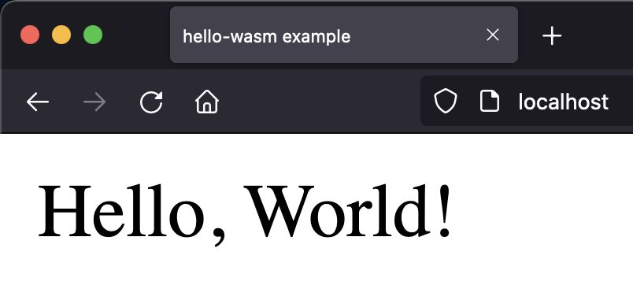

## 8. Rust Framework for Frontend Web Apps

In previous sections, we have seen how we can create apps that are a mix of
Wasm and JS modules.
We can go a step further and completely write a frontend web app only in Rust,
using [**Yew**](https://yew.rs/) framework.

**Yew** is a compontent-based framework which makes it easy to create interactive UIs.
Developers who have experience with frameworks like **React** and **Elm** should feel
quite at home when using **Yew**.

As an introduction to Yew, we are going write a simple app -- there will be a
`+1` button and a counter initialized to `0`.
Every time user clicks the `+1` button, the counter will be incremented by `1`.

Here is how to finished app will look like:

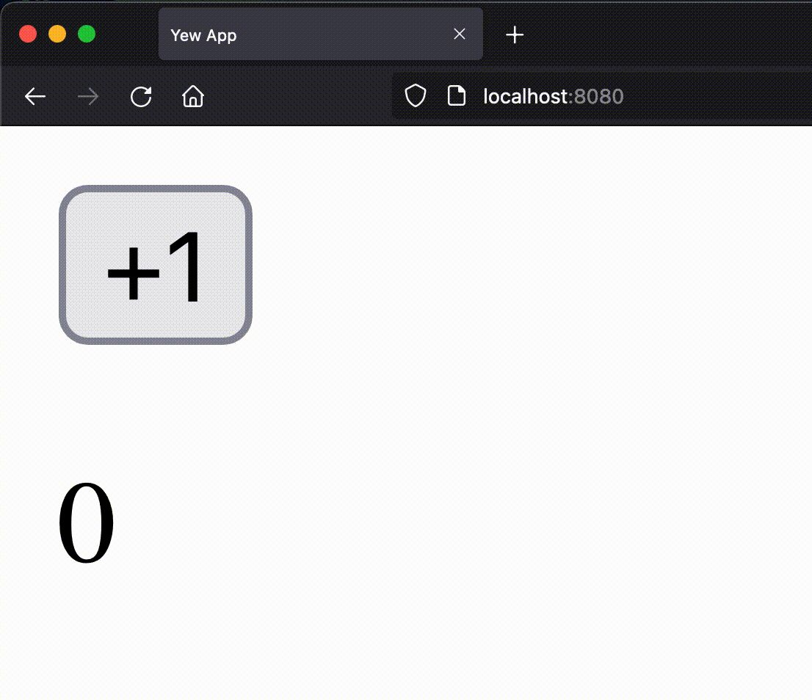

This is how it's implemented:

1. Define messages and component state:

   ```rust
   enum Msg {
       AddOne,
   }

   struct Model {
       value: i64,
   }
   ```

   `Model` struct represents a Yew component.
   Fields of this struct represent component state.
   In this example, state is `value` of type `i64` (64 bit integer).

   `Msg` enum declares all events that can occur inside of a component,
   such as user clicking a button, completing a form, etc.
   In this example, there is only 1 event -- `AddOne`, which is triggered
   when user clicks the `+1` button.

2. Implement `Component` trait (interface) for the `Model` struct:

   ```rust
   impl Component for Model {
       type Message = Msg;
       type Properties = ();

       fn create(_ctx: &Context<Self>) -> Self {
           Self { value: 0 }
       }

       fn update(&mut self, _ctx: &Context<Self>, msg: Self::Message) -> bool {
           match msg {
               Msg::AddOne => {
                   self.value += 1;
                   true
               }
           }
       }

       fn view(&self, ctx: &Context<Self>) -> Html {
           let link = ctx.link();
           html! {
               <div>
                   <button onclick={link.callback(|_| Msg::AddOne)}>{ "+1" }</button>
                   <p>{ self.value }</p>
               </div>
           }
       }
   }
   ```

   The most important methods of `Component` trait are `create`, `update` and `view`.

   - `create` method -- used as a constructor, to initialize component's state.
     In this example, we are initializing `value` to `0`.
   - `view` method -- used to define the UI of the component.
     Yew provides `html!` macro which enables us to define the UI
     using a special syntax, in similar fashion to JSX.
     To display a state value, we use the curly braces and access the value through
     `self`.
     When the button is clicked, a callback function is called, which returns
     `AddOne` message from our `Msg` enum we created earlier.
   - `update` method -- handles events and updates the component state.
     Update method receives the event as a `msg` parameter.
     We can then match on that enum and handle different events.
     In case of `AddOne` event, we just increment the state `value` by `1`.
     After the state is updated, we return `true` from the `update` function --
     this tells Yew that the state has change and that it should trigger a rerender.
     Yew will then call the `view` method again and display the updated value.

And that is it, we just made our first Yew app!

Yew also has many more exciting features, such as:

- Function components
- Context API
- Router
- CSS-in-Rust

These features are out of scope of this article, but if you are interested
to learn more, I suggest heading to their [official website](https://yew.rs/)
and checking out their awesome documentation.

## 9. Made with WebAssembly

In this section we are going to see some existing projects that are using Wasm,
to serve as an inspiration for what is possible to achieve.

Some popular companies using Wasm:

_**NOTE:** The following list contains proprietary software.
I do not in any way endorse such software,
and I encourage you to always use free software when possible.
The purpose of this list is just to highlight some real world use cases for using Wasm._


- **Figma** -- vector graphics editor and prototyping tool.
  They claim that
  [WebAssembly cut Figma's load time by 3x](https://www.figma.com/blog/webassembly-cut-figmas-load-time-by-3x/).
- **Unity** -- cross platform game engine.
  It supports [exporting games to the Web using Wasm](https://blog.unity.com/technology/webassembly-is-here).
- **1Password** -- password manager.
  They claim that they were able to achieve [up to 39x performance increase by
  switching to Wasm](https://blog.1password.com/1password-x-may-2019-update/).
- **AutoCAD** -- computer-aided design and drafting software.
  Legacy C/C++ codebase was [ported to the Web using C++ to Wasm compiler emscripten](https://www.youtube.com/watch?v=BfkL3WgOPdI).
- **Google Earth** -- 3D representation of Earth based on satellite imagery.
  Pieces of the old C/C++ application code were [ported to the Web
  using emscripten](https://web.dev/earth-webassembly/).
- **Disney+** -- streaming service.
  [Client app written in Rust and compiled to Wasm](https://medium.com/disney-streaming/introducing-the-disney-application-development-kit-adk-ad85ca139073).
- **Amazon Prime Video** -- streaming service.
  Parts of app were [written in Rust and compiled to Wasm for improved performance](https://www.amazon.science/blog/how-prime-video-updates-its-app-for-more-than-8-000-device-types).

Some interesting free software projects using Wasm:

- [**uBlock Origin**](https://github.com/gorhill/uBlock) -- content blocker
  by [Raymond Hill](https://github.com/gorhill) under GPLv3 license.

  Performance sensitive parts were written in Wasm.
  For example, hostname-lookup algorithm implemented in Wasm was
  1.5x faster than the equivalent algorithm implemented in JS
  when benchmarked on my laptop:

  

- [**ffmpeg.wasm**](https://github.com/ffmpegwasm/ffmpeg.wasm) -- FFmpeg for
  browser and node, powered by Wasm.
  Created by [Jerome Wu](https://github.com/jeromewu) under Expat license.

  FFmpeg is a tool for audio/video transcoding.
  In my current company, we had a backend service that did some audio transcoding using
  FFmpeg in order to convert user submitted files into a desired audio format.
  With FFmpeg being ported to Wasm, we could've moved that transcoding
  logic to the frontend, achieving infinite scalability of that service,
  without costing us anything -- every user would do their own transcoding
  in their own browser, and just send us the file in the desired format.

  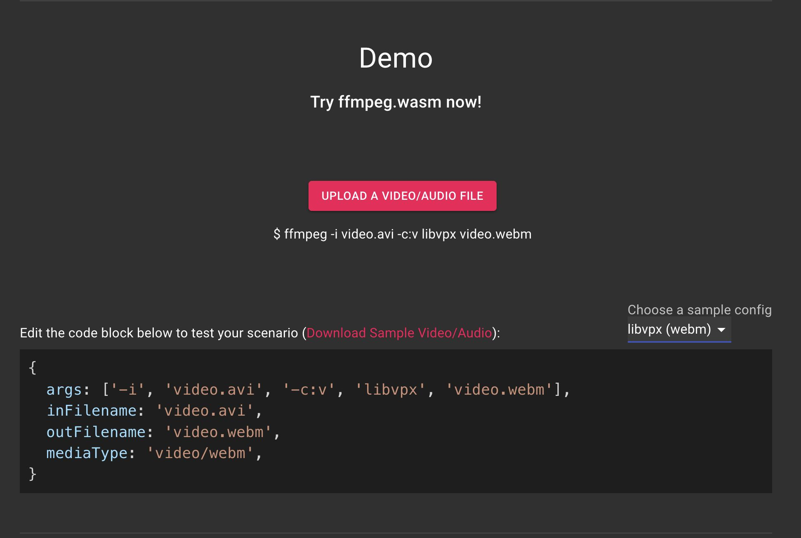

- [**vim.wasm**](https://github.com/rhysd/vim.wasm) -- Vim ported to Wasm.
  Created by https://github.com/rhysd under Vim license.

  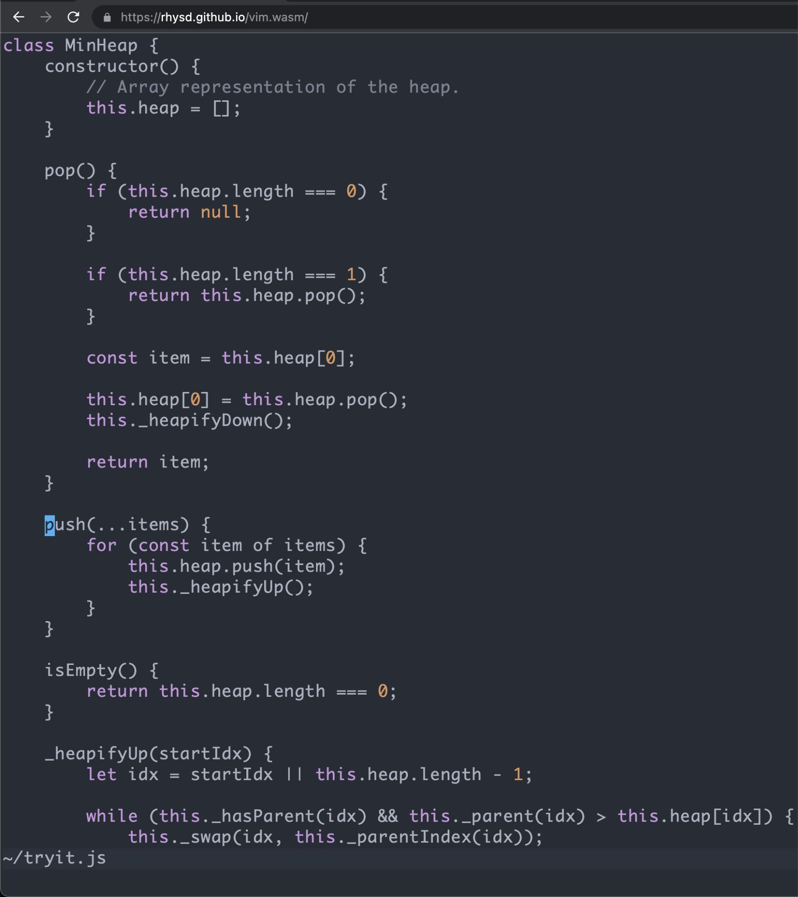

- [**D3wasm**](https://wasm.continuation-labs.com/d3demo/) -- Doom 3 ported to
  Wasm and WebGL.
  Created by Gabriel Cuvillier under GPLv3 license.

  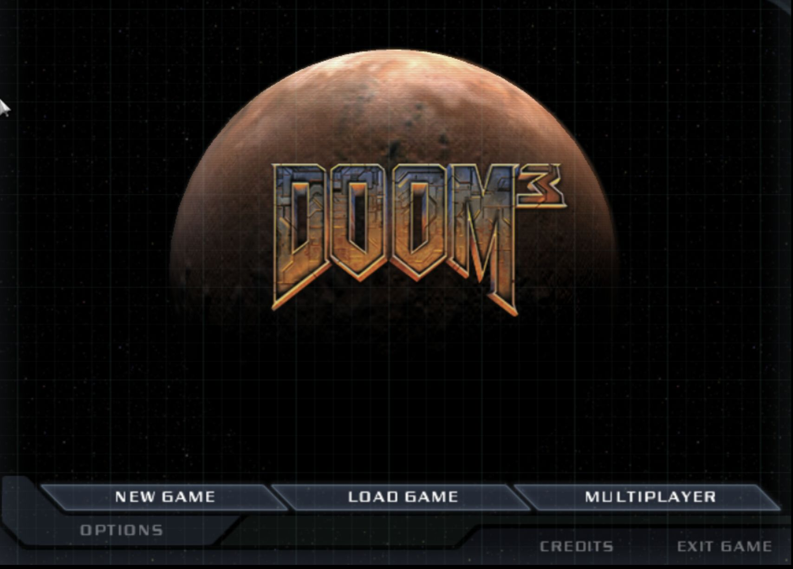

- [**Ruffle**](https://github.com/ruffle-rs) -- Flash Player emulator built in
  the Rust programming language.
  Created by Ruffle LLC under either Apache 2.0 or Expat license.

  

- [**Wasmboy**](https://github.com/torch2424/wasmboy) --
  Game Boy/Game Boy Color Emulator Library written for Wasm.
  Created by [Aaron Turner](https://github.com/torch2424) under Apache 2.0 license.

  

- [**v86**](https://github.com/copy/v86) -- x86 virtualization in your browser,
  recompiling x86 to Wasm on the fly.
  Created by [Fabian Hemmer](https://github.com/copy)
  under BSD 2-Clause "Simplified" License.

  This project is crazy.
  I was able to run Arch Linux, start Fluxbox inside of an Xorg session,
  and run Firefox, and all of that happened inside of my browser!

  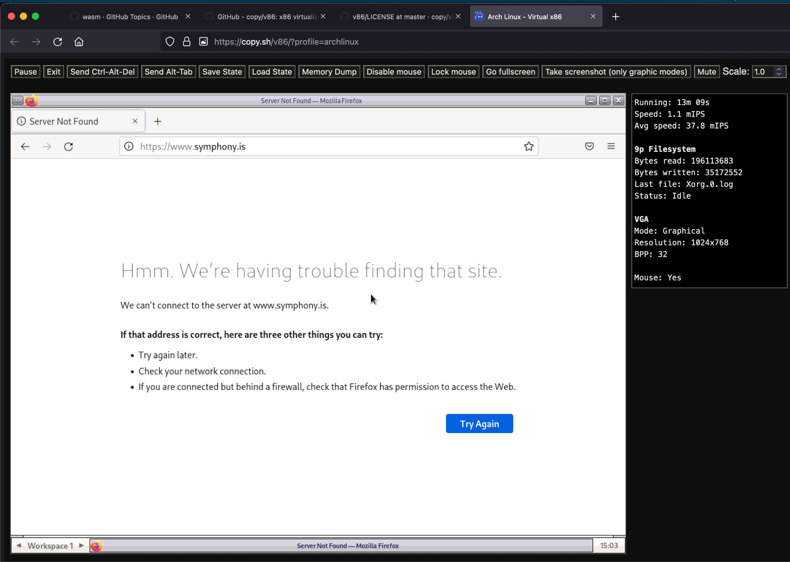

## 10. The Future of WebAssembly

Wasm is a relatively new standard.
It was initially released as a minimal viable product, with the intention of
extending and improving it incrementally.
Many new features are being worked on, but the most important one in my opinion
is WASI -- WebAssembly System Interface.

WASI is a specification for the universal API and ABI that all Wasm runtimes
should support.
You can think of it as a standard library for Wasm, that will provide
access to several operating-system-like features, including files and filesystems,
sockets, clocks, random numbers, etc.

Wasm is meant to be portable, but if we interact with Web APIs and JS,
we are making our programs tied to the Web browser.
With the introduction of WASI, we will be able to make Wasm code truly portable
across all Wasm runtimes!

And to finish off this article, I will leave a tweet by Solomon Hykes,
the creator of Docker.
He sums up really well how important WASI and Wasm are:

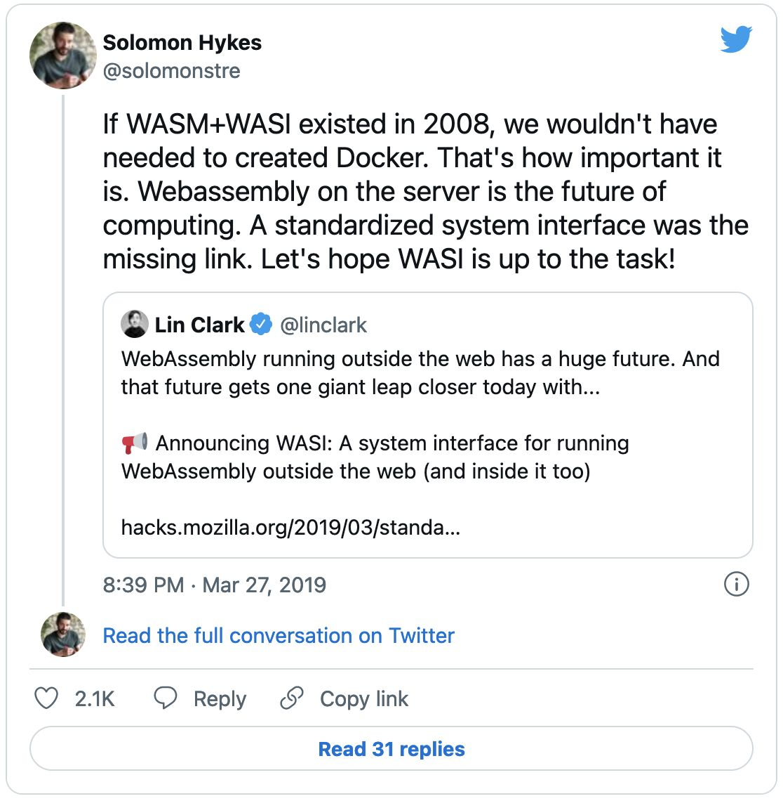

## 11. Reference

- https://developer.mozilla.org/en-US/docs/WebAssembly
- https://rustwasm.github.io/docs/book/
- https://rustwasm.github.io/docs/wasm-bindgen/
- https://rustwasm.github.io/docs/wasm-pack/
- https://www.novatec-gmbh.de/en/blog/look-ma-no-js-compiling-rust-to-webassembly/
- https://harshal.sheth.io/2022/01/31/webassembly.html
- https://hacks.mozilla.org/2017/07/memory-in-webassembly-and-why-its-safer-than-you-think/
- https://yew.rs/
- https://wiki.osdev.org/WebAssembly
- https://madewithwebassembly.com/
- https://www.rust-lang.org/learn

[Cover image](https://github.com/rustwasm/wasm-pack/blob/master/docs/public/img/wasm-ferris.png)
by [Ashley Williams](https://github.com/ashleygwilliams)
and [rustwasm Working Group](https://github.com/rustwasm/team).
