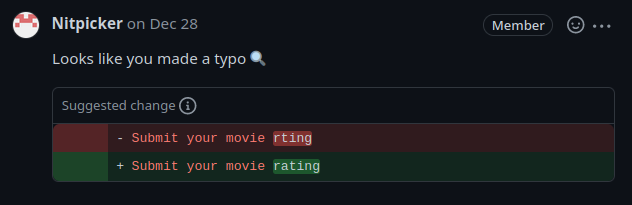

import crFixesCommit from "./cr-fixes-commit.svg?raw";
import fixupCommit from "./fixup-commit.svg?raw";
import gitAmend from "./git-amend.svg?raw";
import gitRebase from "./git-rebase.svg?raw";
import initialGitHistory from "./initial-git-history.svg?raw";
import moreCrFixesCommit from "./more-cr-fixes-commit.svg?raw";

## 1. The Problem

You have been assigned to work on a new feature.
You finish it up, write some tests, everything works.
Since you care about commit messages, you decide to divide the work
into multiple commits with meaningful messages:

<div set:html={initialGitHistory} class="mx-auto max-w-fit" />

You create a pull request, and wait for your colleagues to review it.

_5 minutes later..._



Not too bad, you just fix that little typo and push a new commit.

<div set:html={crFixesCommit} class="mx-auto max-w-fit" />

Another colleague comes and suggests a few more changes.
No problem, you say, let me just create a new commit real quick.

<div set:html={moreCrFixesCommit} class="mx-auto max-w-fit" />

You spent so much time crafting useful commits initially,
but now you have a whole bunch of useless commits on top.
Future `git-blame` users will want to find a useful commit that explains a meaningful change,
and not a commit that immediately fixes a minor mistake.
This is just noise that provides no value.

## 2. Amend the Latest Commit

Let's rewind the story a little bit:

<div set:html={initialGitHistory} class="mx-auto max-w-fit" />

You just created a pull request, and a colleague spotted a typo.
You fix the typo, but this time you run the following command:

```bash
git commit --amend
```

Instead of creating a new commit, Git will modify the latest commit:

<div set:html={gitAmend} class="mx-auto max-w-fit" />

<div class="alert">
  Git commits are immutable. When I say "modify", what actually happens is that
  Git replaces the commit at the tip of the current branch with a completely new
  commit.
</div>

Now that the history has been modified,
we now have to do a force-push instead of a normal push
in order to send our changes to the remote:

```bash
git push --force-with-lease
```

And that is it!
Amending a commit was just as simple as creating a new one,
but this time we preserved our beautiful history.

## 3. Amend Other Commits

As we have seen in the previous section,
amending a commit at the tip of the branch is a very simple process.
Let's make it a bit more complicated this time.

<div set:html={initialGitHistory} class="mx-auto max-w-fit" />

Say your colleague found a typo, but the typo is related to a change
made in the commit `[0004] Generic rating component`.
You cannot use a simple `git commit --amend` fix as that would modify the latest
commit `[0006] Comment rating system`.

What you can do instead is to create a normal "fix typo" commit,
and then start an interactive rebase:

```bash
git commit "fix typo"
git rebase --interactive --keep-base main
```

This will open up a special file in our text editor, prefilled with the following contents:

```git-rebase
pick 0004 Generic rating component
pick 0005 Movie rating system
pick 0006 Comment rating system
pick 0007 fix typo
```

We can see the list of commits on this feature branch,
and a rebase command on the left of each commit.
The default rebase command is `pick`, which just reapplies the commit without any changes.
So if we were to leave the `pick` command on all commits, exactly _nothing_ would happen.

As the name suggests, interactive rebase allows us to modify this file interactively.
We can move the `fix typo` commit immediately below the commit `0004` we want to fix,
and then change the rebase command to `fixup`:

```git-rebase
pick 0004 Generic rating component
fixup 0007 fix typo
pick 0005 Movie rating system
pick 0006 Comment rating system
```

If we save this file and close the text editor, Git will go through each line one by one
and apply the specified rebase command to each commit.
The `fixup` command will merge the commit with the one preceding it,
creating a single commit:

<div set:html={gitRebase} class="mx-auto max-w-fit" />

Once again, our beautiful commit history has been preserved.

## 4. Automate the Git Rebase

We can even do one better, by automating the interactive rebase process.
Instead of creating a new "fix typo" commit, we can create a special "fixup" commit:

```bash
git commit --fixup 0004
```

To reference a commit we want to fix, we can use the commit's SHA,
which is `0004` in the example above.

Alternatively, we can use one of the
[many other ways Git allows us to reference a commit](https://git-scm.com/docs/gitrevisions).
For example, we could reference a commit by its commit message:

```bash
git commit --fixup ":/Generic rating component"
```

After we create a special fixup commit, the history will look like this:

<div set:html={fixupCommit} class="mx-auto max-w-fit" />

To apply the fixup, we can then run the following command:

```bash
git rebase --interactive --keep-base main --autosquash
```

The rebase command looks similar to the one we ran in the previous section,
but notice that we now use the `--autosquash` flag.
This flag will automatically reorder the commits and apply the fixup command:

```git-rebase
pick 0004 Generic rating component
fixup 0007 fixup! Generic rating component
pick 0005 Movie rating system
pick 0006 Comment rating system
```

We just have to save the file and close the editor, and Git will do all the magic for us.

We can even make `git rebase` use the `--autosquash` flag by default, by changing our Git config:

```bash
git config --global rebase.autosquash true
```

## 5. Recommended Pull Request Flow

While your colleagues are reviewing your pull request,
it may be confusing to them if you rewrite the history and do a force push.
If they suggest you fix a typo, and you amend an existing commit,
they will not be able to see easily what changes have been made since the last time
they did a review.

To get the best of both worlds, I suggest the following flow:

1. Create a pull request.
2. Make the necessary changes and create the fixup commits using `git commit --fixup`.
3. Push the fixup commits so your colleagues can easily see what changes
   have been made since the last time they reviewed the pull request.
4. Once the pull request is approved and ready to merge,
   do a `git rebase --interactive --keep-base main --autosquash`
   and force push the cleaned up history.
5. Merge the pull request.

Using this technique, your teammates will have an easy time reviewing your PRs,
while also leaving a clean history for future readers to use.
